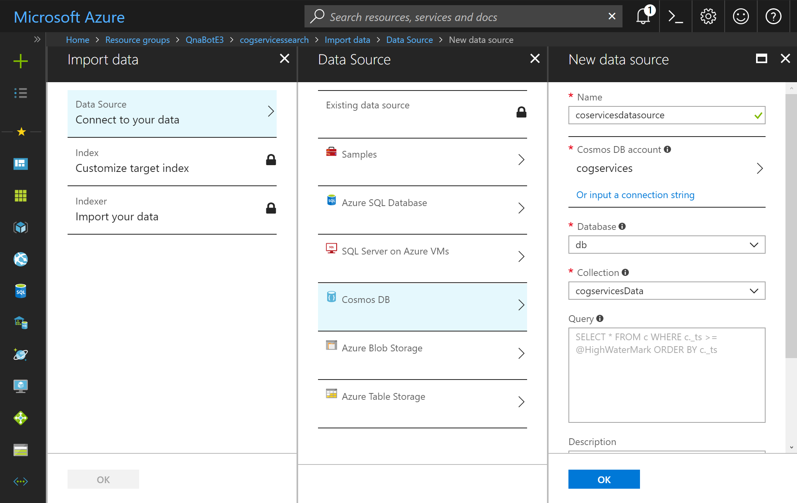
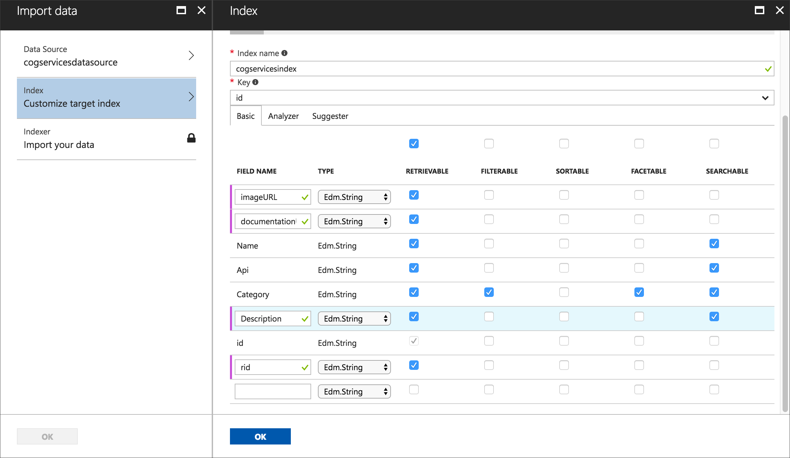
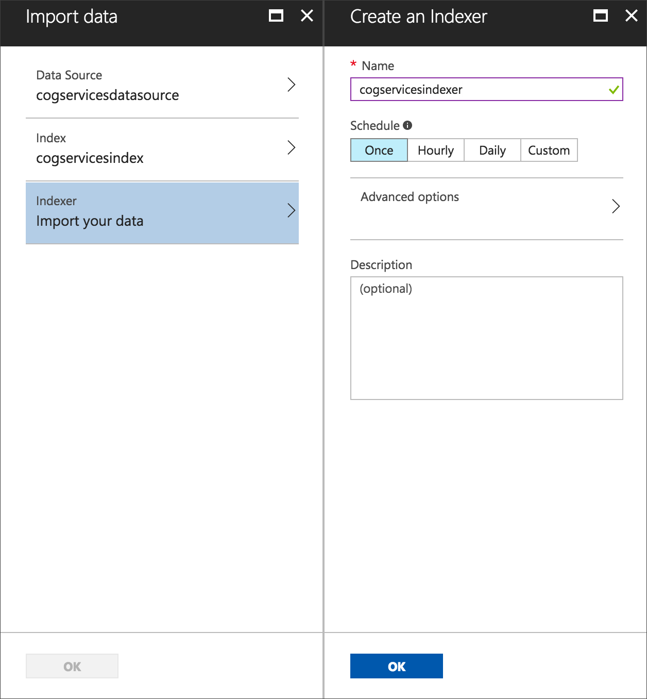
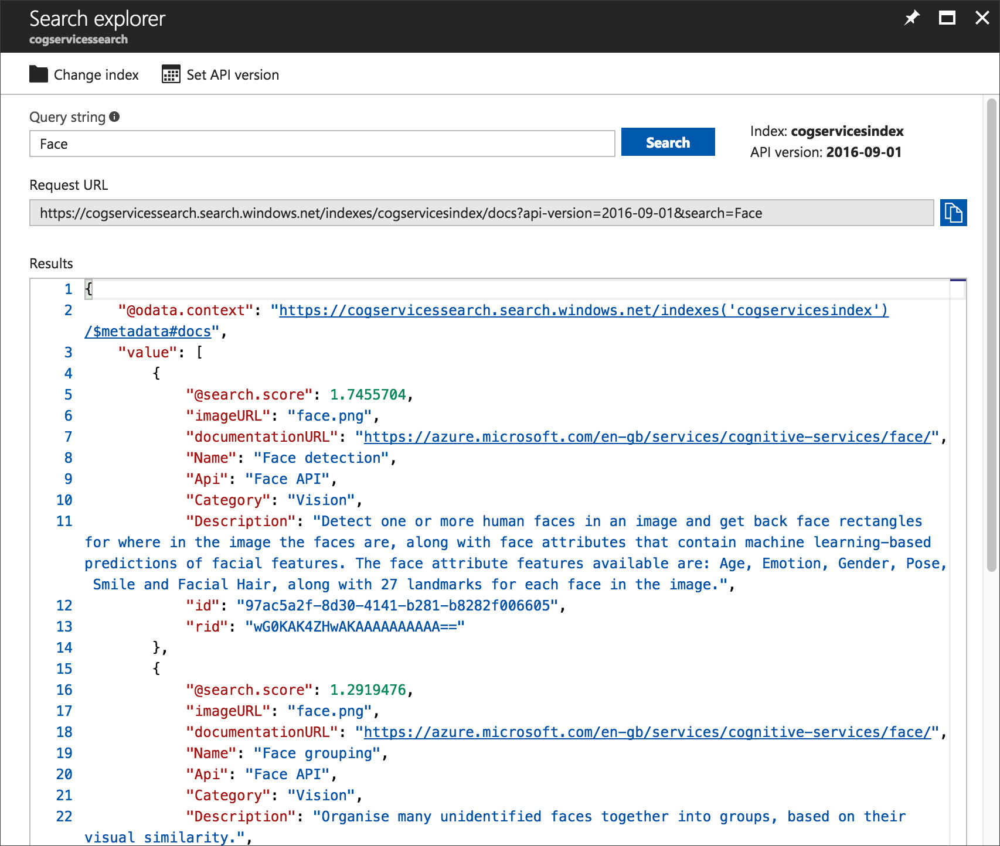
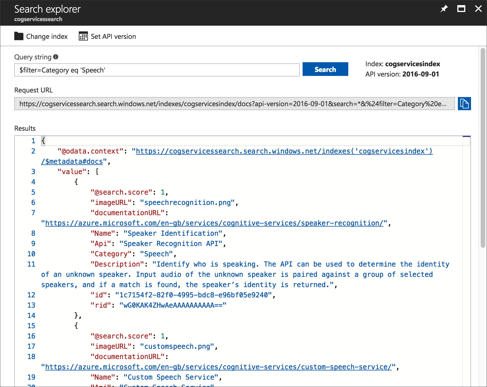

# Azure Search

##### 1. Create the Azure Search
Create the new Search Service and assign it to the same resource group.

##### 2. Import data into the Search Service.
- Once the Search Service has been created. Click on 'Import Data'.

- When prompted to select a data source choose 'Cosmos DB' and select an account we created earlier.

##### Create your Azure Search Index
Here's where the magic starts to happen. You can see that Azure Search has accessed our data and pulled in each parameter of the `JSON` objects. Now we get to decide which of these parameters we want to search over, facet over, filter by and retrieve. Again we could generate our indices programatically, and in more complex use cases we would, but for the sake of simplicity we'll stick to the portal UI. Given that we want access to all of these properties we'll go ahead and make them all retrievable. We want to be able to facet (more details about faceting to come) and filter over Categories. Finally, we'll mark `name`, `api`, `category` and `description` as searchable so that our bot can search using general terms.

##### 4. Create the Azure Search indexer
As our data is subject to change, we need to be able to reindex that data. Azure Search allows you to index on a schedule or on demand, but for this demo we'll index once only.

##### 5. Use the Search Explorer

We can verify that our index is properly functioning by using the Azure Search Explorer to enter example searches, filters and facets. This can be a very useful tool in testing out queries as you develop your bot. _Note: If you enter a blank query the explorer should return all of your data_.

Let's try three different queries:

`Face`

Given that our index searches over the different Cognitive Services, a search of "Face" returns all the relevant entries information associated with the Face API along with a search score. The search score represents the confidence that Azure Search has regarding each result.

`facet=Category`

Faceting allows us to see the different examples of a parameter and their corresponding counts. You can see here that the JSON response from the search API tells us the number of Vision, Speech, Language, Knowledge, and Search APIs available.

This information will allow us to guide the conversation our bot can have. If a user wishes to see Cognitive Services by category, our bot can quickly and efficiently find all the Cognitive Services that are available within a category and present them as options to the user.

`$filter=Category eq 'Speech'`

