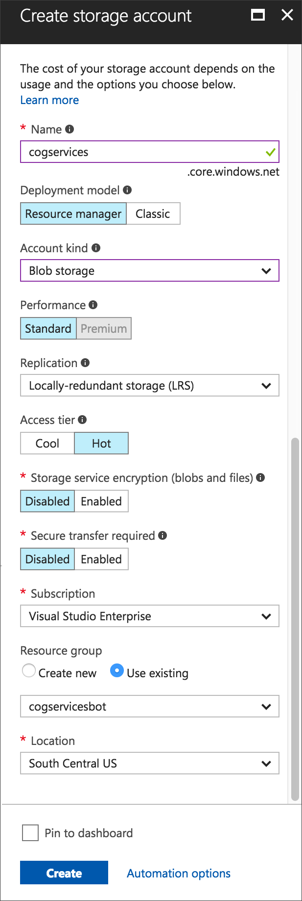

# Storage
## Blob Storage
Navigate to the Azure portal and create a new Storage account.

##### Create a new Container
Create a new container named _images_ and set its public access level to _Blob_

##### Upload the images

We're going to use the Storage Explorer to upload our image assets to the newly created Storage Container.
 If you don’t have the Storage Explorer app yet, download it from [storageexplorer.com](https://azure.microsoft.com/en-us/features/storage-explorer/).
 
After authenticating with the Storage Explorer you'll be able to browse to the target container in the new Storage account.
 

Upload all the images in the `resources\images` folder to the target container, then head back to the Azure portal to verify them.

##### Get the Container URL

Now we need to make a note of the Storage Container's URL. Click on _Properties_ and copy the URL to your clipboard - paste it somewhere easy to get hold of for now.

