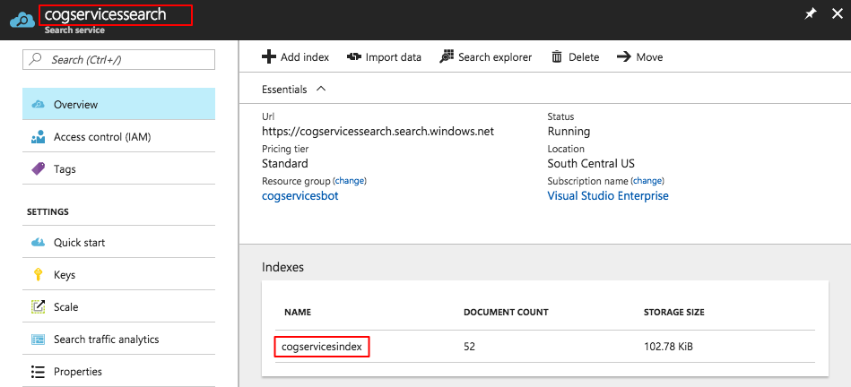
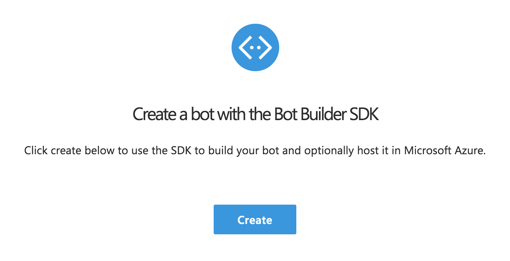
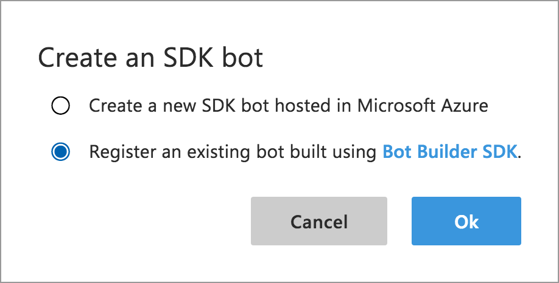
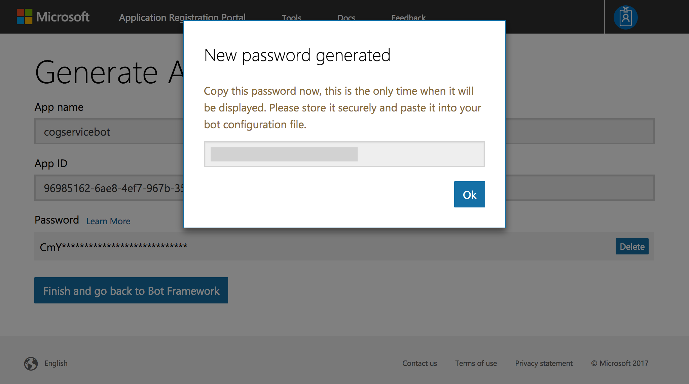
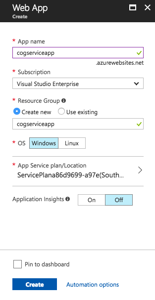
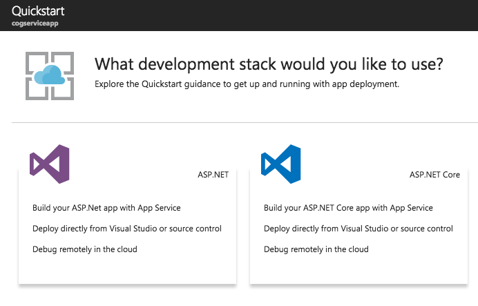

# Bot Configuration

To get started using the Bot straight away within our local environment, we need to configure the source with the credentials from the services we've created.

## WebConfig
The first file we need to update is `WebConfig` which you can find in the root of the source folder. Here we're going to set the following properties: `SearchName`, `IndexName`, `SearchKey`, `BlobStorageURL`.

```
<appSettings>
    ...
    <add key="SearchName" value="[SEARCH_NAME]" />
    <add key="IndexName" value="[SEARCH_INDEX]" />
    <add key="SearchKey" value="[SEARCH_KEY]" />
    <add key="BlobStorageURL" value ="[STORAGE_URL}" />
  </appSettings>
```

### Azure Search

The `SearchName` and `IndexName` values can be found in the Azure Portal on the overview page for our Search Service.



The `SearchKey` can be found on the _Keys_ tab of the Search Service page under the _Manage query keys_ link.


### Azure Storage
The get the `BlobStorageURL` navigate to your Azure Storage instance in Azure and click on the images container we made earlier. From within the images container you can click on _Container properties_ to locate the target URL we need for the `BlobStorageURL` value in the WebService file. 


## DefaultDialog
The `DefaultDialog` class is the main class we use to handle our LUIS queries. The class attributes need to updated reflect the LUIS app id, service key and hosted domain.

```
[LuisModel("[LUIS_APP_ID]", "[LUIS_SERVICE_KEY]", domain: "[LUIS_DOMAIN]")]
[Serializable]
public class DefaultDialog:LuisDialog<object>
{
	...
}
```


### LUIS App ID

The `LUIS_APP_ID` can be obtained from the dashboard of your LUIS app at [Luis.ai](https://www.luis.ai/).


### LUIS Service Key

The `LUIS_SERVICE_KEY` Can be obtained from the Keys tab of your LUIS service in Azure.


### LUIS Domain
 The `LUIS_DOMAIN` can also be obtained from the overview of your LUIS service in Azure. This is the endpoint listed in your LUIS Service overview i.e '_westcentralus.api.cognitive.microsoft.com_'


## Publishing Your Bot

### Bot Emulator
The Bot Framework Emulator is a desktop application that allows bot developers to test and debug their bots, either locally or remotely. Using the emulator, you can chat with your bot and inspect the messages that your bot sends and receives. The emulator displays messages as they would appear in a web chat UI and logs JSON requests and responses as you exchange messages with your bot.

To get started, you can download the Bot Framework Emulator here:
[https://docs.microsoft.com/en-us/bot-framework/debug-bots-emulator](https://docs.microsoft.com/en-us/bot-framework/debug-bots-emulator)

### Publishing Online
After you have built and tested your bot, you need to deploy it to the cloud for other people too use it. 


##### 1. Create a Bot Instance

Head to [dev.botframework.com](https://dev.botframework.com/bots) and create a new bot instance.



##### 2. Register an existing bot

We want to register an existing bot built using the Bot Builder SDK.



##### 3. Register an existing bot

Fill out the required information, don't worry about the 'Messaging endpoint' at the moment, we'll come back to that. 

Click the _'Create Microsoft App ID and password'_ button.


##### 4. Create a Microsoft App ID
Create the App ID and password.


Make sure you copy the new password and make a note of it somewhere then finalise the bot creation.




##### 4. Update the WebConfig

Return to the `WebConfig` file in the bot solution and update it with the new bot information.

```
<appSettings>
    <add key="BotId" value="[YOUR_BOT_ID]" />
    <add key="MicrosoftAppId" value="[APP_ID]" />
    <add key="MicrosoftAppPassword" value="[APP_PASSWORD]" />
    ...
  </appSettings>
```

##### 5. Create a new Web App
To host our new bot we're going to create a web app in Azure. Head over to the Azure portal and get started.



##### 6. Set the Bot's Messaging Endpoint

Use the URL listed in our newly created Web App to set the bots messaging endpoint back at [dev.botframework.com](https://dev.botframework.com/bots). Once the endpoint has been updated, click the Quickstart guide to deploy our code.


##### 7. Populate the Web App
From here you can choose how you want to get the code deployed to the Web App. Select the first ASP.NET option and follow the instructions to get the bot live!




### Finally
There are a number of alternative ways you can deploy your bot online. For more information you can read the documentation here:
[https://docs.microsoft.com/en-us/bot-framework/deploy-bot-overview](https://docs.microsoft.com/en-us/bot-framework/deploy-bot-overview)

