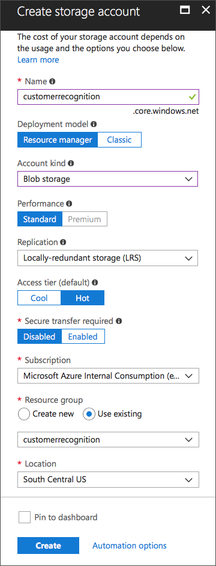
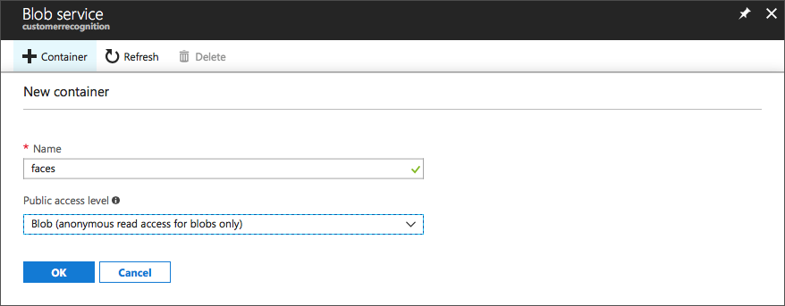
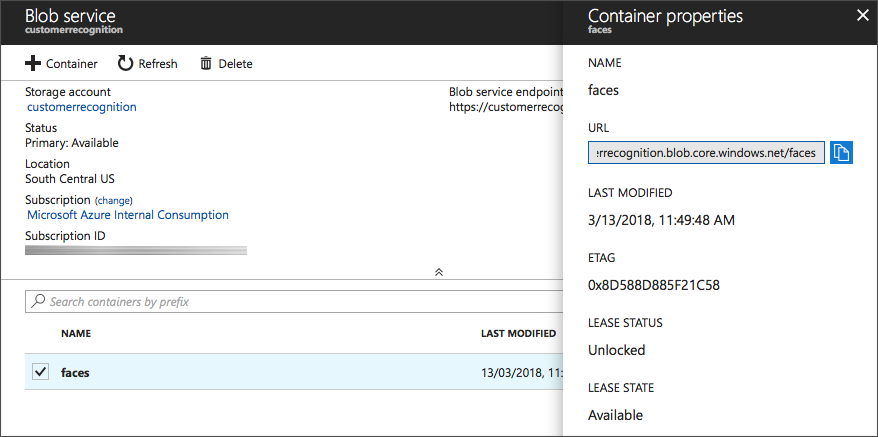

# Storage

Azure Blob storage is a service for storing large amounts of unstructured object data, such as images, videos, audio, documents and more. As part of this example we'll be using Azure Storage to host all of the captured customer images. These images will be used for two purposes, the first is for identification purposes (using the Face API) and the second is for storing against a customers order (this gives the staff a way of visually identifying customers as well).

## Blob Storage

Navigate to the Azure portal and create a new Storage account.

### Create a new Container

Create a new container named _faces_ and set its public access level to _Blob_

### Get the Container URL

Now we need to make a note of the Storage Container's URL. Click on _Properties_ and copy the URL to your clipboard - paste it somewhere easy to get hold of for now.

