# Using Search to create data driven bots

In this demo look at how to use Azure Cosmos DB, Azure Search and the Microsoft Bot Framework to build a bot that searches and filters over an underlying dataset.

## Background

Lorum Ipsum

## Setup: Accounts & Subscriptions

To get started, you’ll need to create/login to a few accounts. (don’t worry, they’re all free)

### Microsoft Azure

We’ll be using Azure Bot Service, so you’ll need an Azure account. If you don’t already have one, you can create a free Azure account [here](https://azure.microsoft.com/free/).

### Microsoft Bot Framework

[Create or login](https://dev.botframework.com/login?requestUrl=%2F) to your [Microsoft Bot Framework](https://dev.botframework.com/) account. Even if you already have an account, make sure to login, as it’ll simplify setting up your bot in Azure.

## Services Used

- CosmosDB
- Azure Search
- Blob Storage
- LUIS
- Bot Framework
- Bing Spellcheck API

***

# Cosmos DataBase

## Database Setup - Cosmos DB

Let's start by looking at the CognitiveServices JSON file, found in the data folder of this project. Each JSON object is made up of six properties: name, api, category, description, documentation URL and an image URL. 

The goal is to provide a service that allows users to search through or explore the range of Cognitive Services available from Microsoft. The dataset contains a listing of all 29 services, but this approach can easily scale to millions of data points. Azure Search is capable of indexing data from several data sources including Cosmos DB, Blob Storage, Table Storage and Azure SQL. We'll use Cosmos DB as a demonstration.
[IMAGE]

### Create a Cosmos DB database and collection

##### 1.  Navigate to Cosmos DB in the Azure Portal

[https://azure.microsoft.com/en-gb/services/cosmos-db/]()

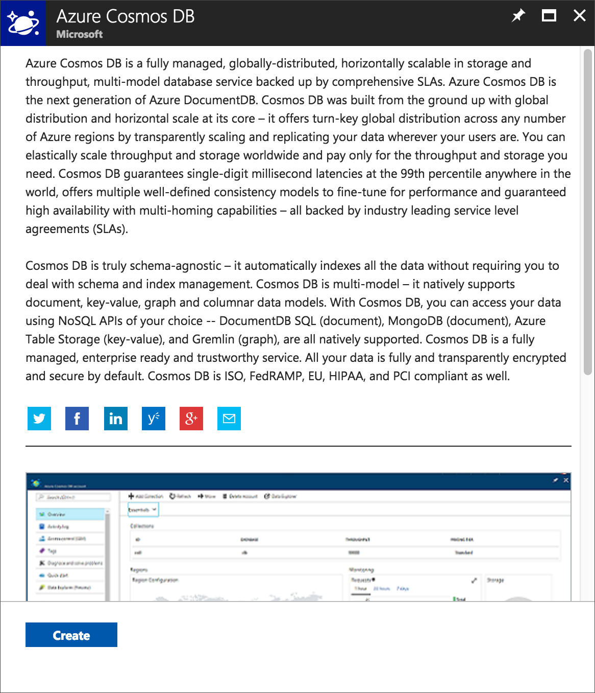

##### 2. Create a Cosmos DB account  
Create a new account with a unique id, in this case I'll be using _'cogservices'_. Select the _'SQL (DocumentDB)'_ API and if needed create a new Resource Group. Then create the Cosmos DB account.

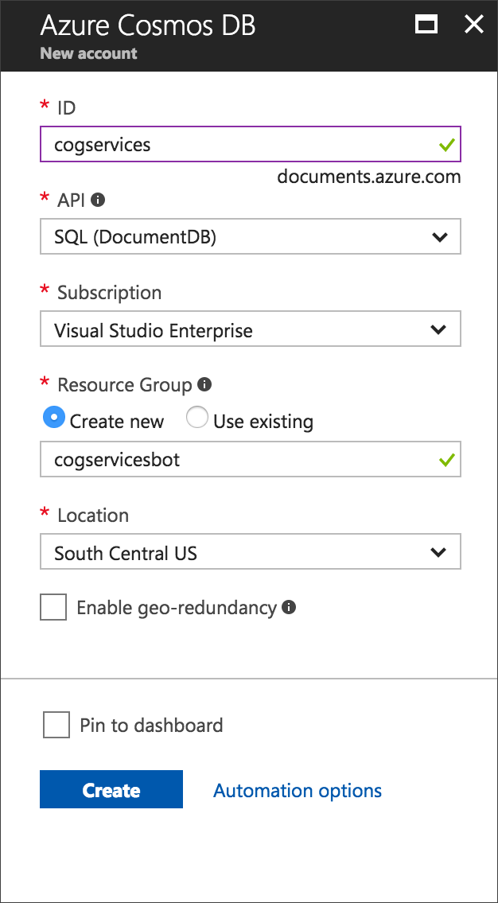

##### 3. Create a new DB (Document DB SQL)  
Click on _Add Collection_ to create a new Database

- Set a fixed storage capacity of 10GB
- Choose the lowest throughput capacity of 400 (Estimated hourly spend $0.032USD)
- Set the database field to 'db'

### Upload JSON data

Now that the database and its collection have been set up its time to upload the JSON data. This can be done programatically or we can use the Azure DocumentDB Data Migration Tool (which is documented here [https://azure.microsoft.com/en-us/documentation/articles/documentdb-import-data/](https://azure.microsoft.com/en-us/documentation/articles/documentdb-import-data/))

##### 1. Open the DocumentDB Data Migration Tool
 Once you've downloaded the tool, open the 'dtui.exe' and navigate to the supplied JSON data:

##### 2. Get the Upload connection string
Get a connection string from the Cosmos DB portal.  

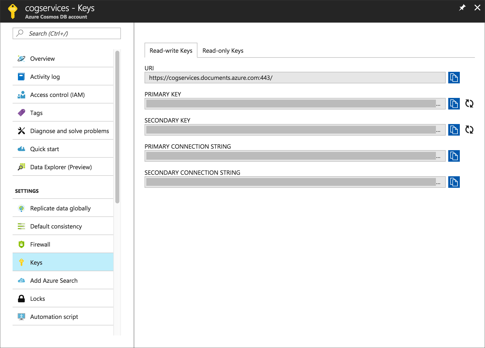

##### 3. Fill in the target information
- Be sure to add Database = [YOUR DATABASE ID]; to your connection string. 
- Set the Collection ID field
- Confirm all the settings and upload the JSON file

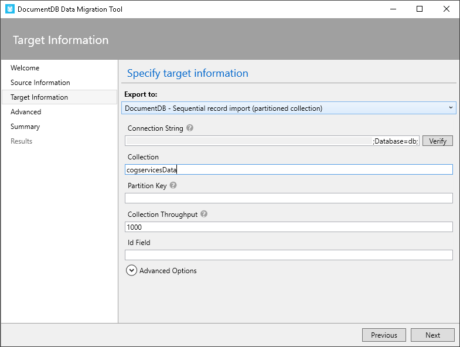

Upload the data.

##### 4. Verify the data
To verify that the data has successfully uploaded, return to the Azure CosmosDB instance and Click on the Query Explorer. Run the default Query `SELECT * FROM c`  

***

# Azure Search

##### 1. Create the Azure Search
Create the new Search Service and assign it to the same resource group.

##### 2. Import data into the Search Service.
- Once the Search Service has been created. Click on 'Import Data'  

- Select 'DocumentDB' and select an account (choose the Database service we created earlier) 

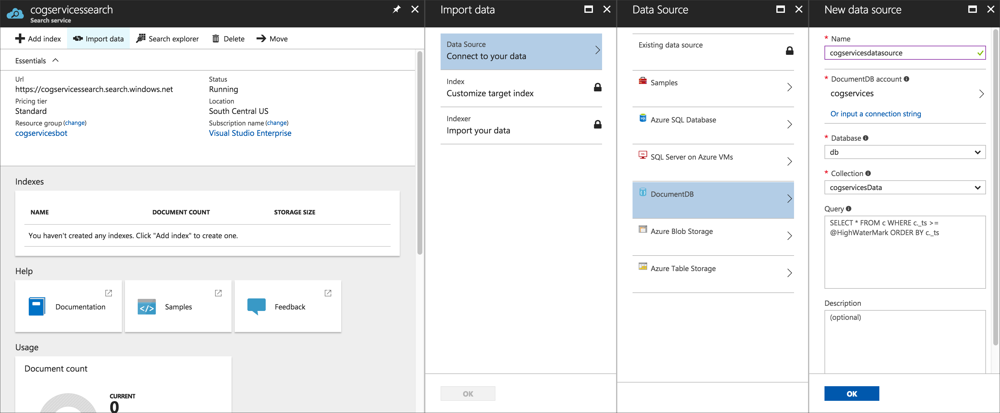

##### Create your Azure Search Index
Here's where the magic starts to happen. You can see that Azure Search has accessed our data and pulled in each parameter of the JSON objects. Now we get to decide which of these parameters we want to search over, facet over, filter by and retrieve. Again we could generate our indices programatically, and in more complex use cases we would, but for the sake of simplicity we'll stick to the portal UI. Given that we want access to all of these properties we'll go ahead and make them all retrievable. We want to be able to facet (more details about faceting to come) and filter over Categories. Finally, we'll mark name, api, category and description as searchable so that our bot can search using general terms.

##### 4. Create the Azure Search indexer
As our data is subject to change, we need to be able to reindex that data. Azure Search allows you to index on a schedule or on demand, but for this demo we'll index once only.

##### 5. Use the Search Explorer

We can verify that our index is properly functioning by using the Azure Search Explorer to enter example searches, filters and facets. This can be a very useful tool in testing out queries as you develop your bot. Note: If you enter a blank query the explorer should return all of your data.

Let's try three different queries:

`Face`

Given that our index searches over the different Cognitive Services, a search of "Face" returns all the relevant entries information associated with the Face API along with a search score. The search score represents the confidence that Azure Search has regarding each result.

`facet=Category`

Faceting allows us to see the different examples of a parameter and their corresponding counts. You can see here that the JSON response from the search API tells us that there are 24 Vision, 6 Speech, [X] Language, [X] Knowledge, [X] Search and [X] Labs APIs.

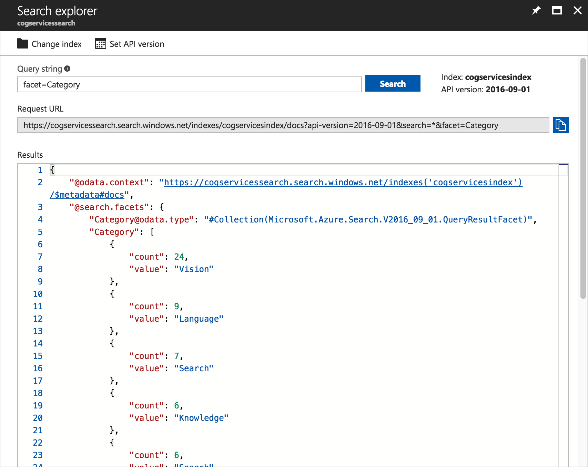

This information will allow us to guide the conversation our bot can have. If a user wishes to see Cognitive Services by category, our bot can quickly and efficiently find all the Cognitive Services that are available within a category and present them as options to the user.

`$filter=Category eq 'Speech'`

***

# Storage
## Blog Storage
Navigate to the Azure portal and create a new Storage account.

##### Create a new Container
Create a new container named _images_ and set its public access level to _Blob_

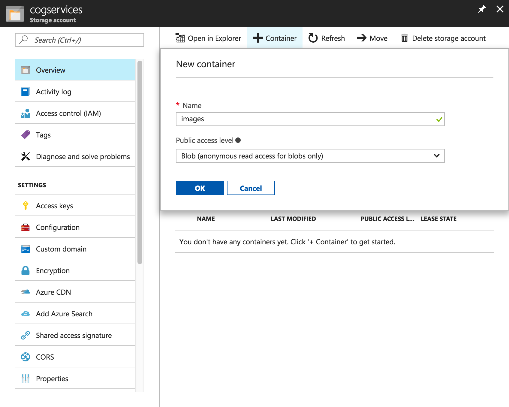

##### Upload the images

We're going to use the Storage Explorer to upload our image assets to the newly created Storage Container.
 If you don’t have the Storage Explorer app yet, download it from [storageexplorer.com](https://azure.microsoft.com/en-us/features/storage-explorer/).
 
After authenticating with the Storage Explorer you'll be able to browse to the target container in the new Storage account.
 
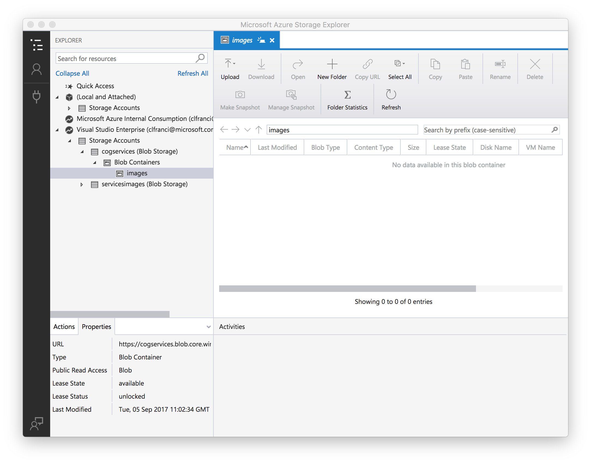

Upload all the images in the `resources\images` folder to the target container, then head back to the Azure portal to verify them.

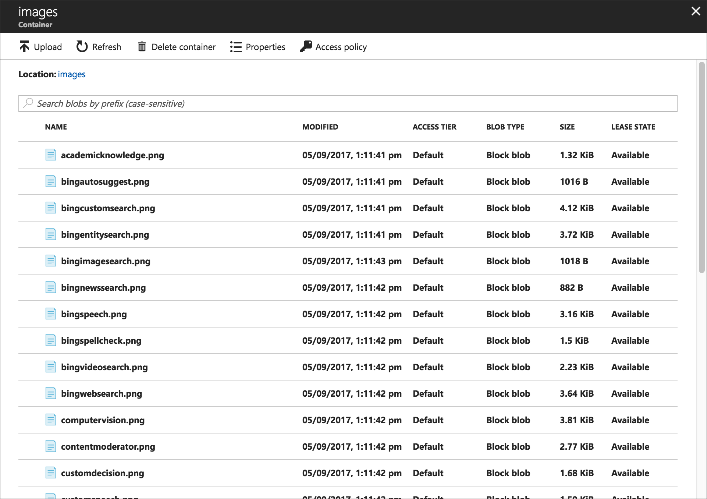

##### Get the Container URL

Now we need to make a note of the Storage Container's URL. Click on _Properties_ and copy the URL to your clipboard - paste it somewhere easy to get hold of for now.

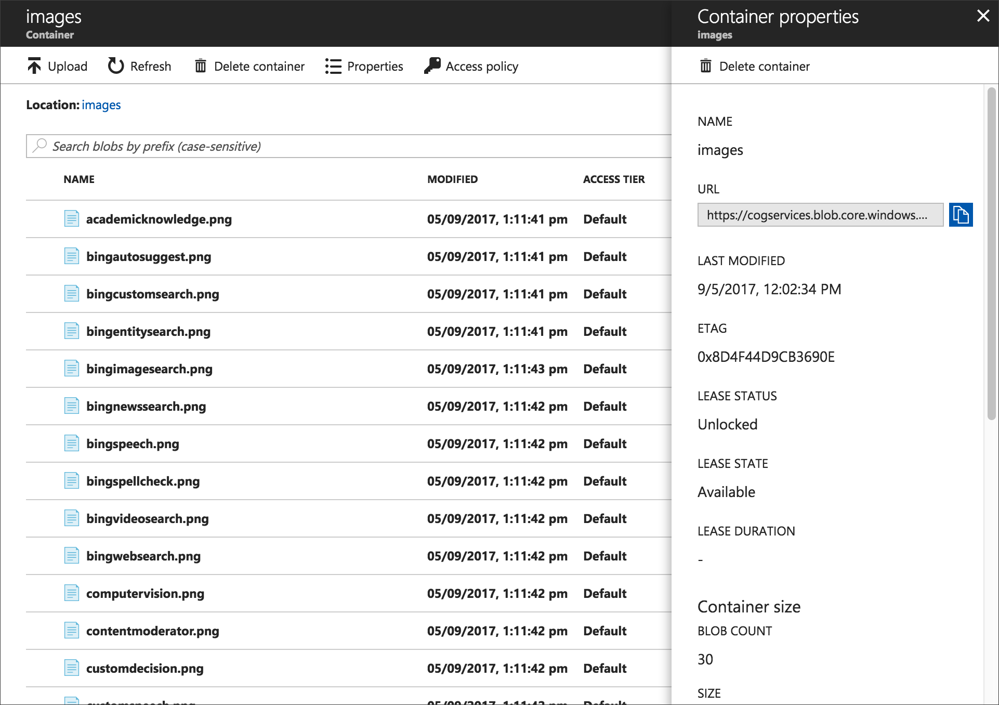

***

# LUIS 
## Language Understanding Entity Service

##### What is LUIS?
Language Understanding Intelligent Service (LUIS) enables developers to build smart applications that can understand human language and react accordingly to user requests. LUIS uses the power of machine learning to solve the difficult problem of extracting meaning from natural language input, so that your application doesn't have to. Any client application that converses with users, like a dialog system or a chat bot, can pass user input to a LUIS app and receive results that provide natural language understanding.

### Key Concepts

**_What is an utterance?_** An utterance is the textual input from the user, that your app needs to interpret. It may be a sentence, like "Book me a ticket to Paris", or a fragment of a sentence, like "Booking" or "Paris flight." Utterances aren't always well-formed, and there can be many utterance variations for a particular intent.

**_What are intents?_** Intents are like verbs in a sentence. An intent represents actions the user wants to perform. It is a purpose or goal expressed in a user's input, such as booking a flight, paying a bill, or finding a news article. You define a set of named intents that correspond to actions users want to take in your application. A travel app may define an intent named "BookFlight", that LUIS extracts from the utterance "Book me a ticket to Paris".

**_What are entities?_** If intents are verbs, then entities are nouns. An entity represents an instance of a class of object that is relevant to a user’s intent. In the utterance "Book me a ticket to Paris", "Paris" is an entity of type location. By recognising the entities that are mentioned in the user’s input, LUIS helps you choose the specific actions to take to fulfil an intent.

### Utilising LUIS
For this demo we're going to use LUIS to interpret the users Utterance and return us the intended recognised Intent. The returned Intent  will contain the Entity that we'll use to trigger our Azure Search functionality.

##### 1. Create a new LUIS application

The first thing we're going to need to do is create a new LUIS app. To do this you'll need to head to [luis.ai](http://www.luis.ai) and sign in with your Microsoft account. Once signed in you'll be able to create a new LUIS app.

Give your app a name and if you wish a description. When selecting an API key we're just going to use the `Bootstrap key` that comes with the LUIS app to get started.

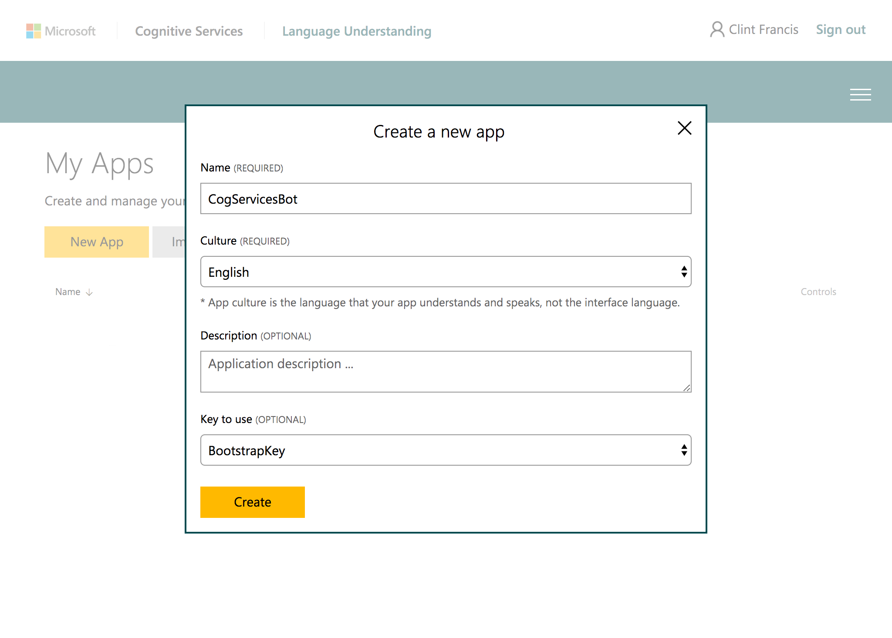

##### 2. Add Entities

Once your app has been created we're going to set up our  entities first so that they are ready when we create our intents. We need two simple entities, one that is associated with products and one for requesting help.

Let's Create two _Simple_ entities. You can use any string name for these, but for our example we're going to use:

`congitiveservice.product`

`congitiveservice.help`

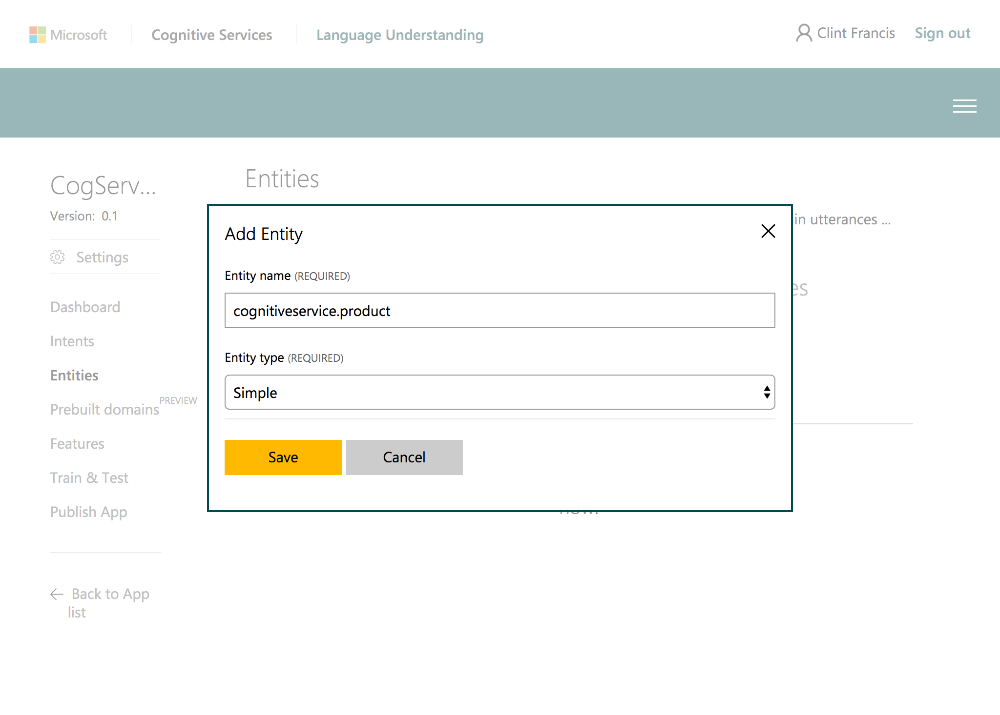

##### 3. Add Intents

Our bot has two main use cases; handling queries about a specific service, or assisting a user explore what the cognitive services offer.

Let's create the two intents Within our LUIS instance. Again, you can use any string name for these, but for our example we're going to use:

`services.search`

`services.help`

##### 4. Add Utterances

For each intent of our intents we need to add some example utterances that trigger this intent. To ensure that our intent gets matched correctly we should include multiple utterance variations. The more relevant and diverse we add to the intent, the better intent prediction we’ll get from the app.

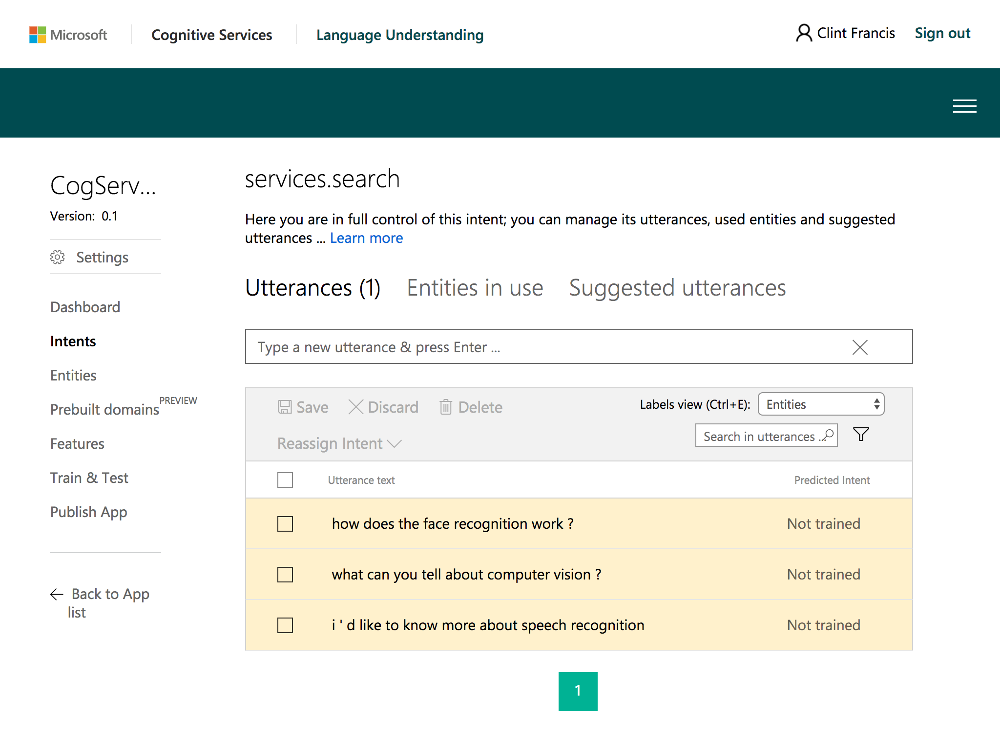

After entering in our utterances we can then identify the entities within the utterance. Simply click on the words within the utterance that you want to mark as being an entity and mark them with the matching entity in the list.

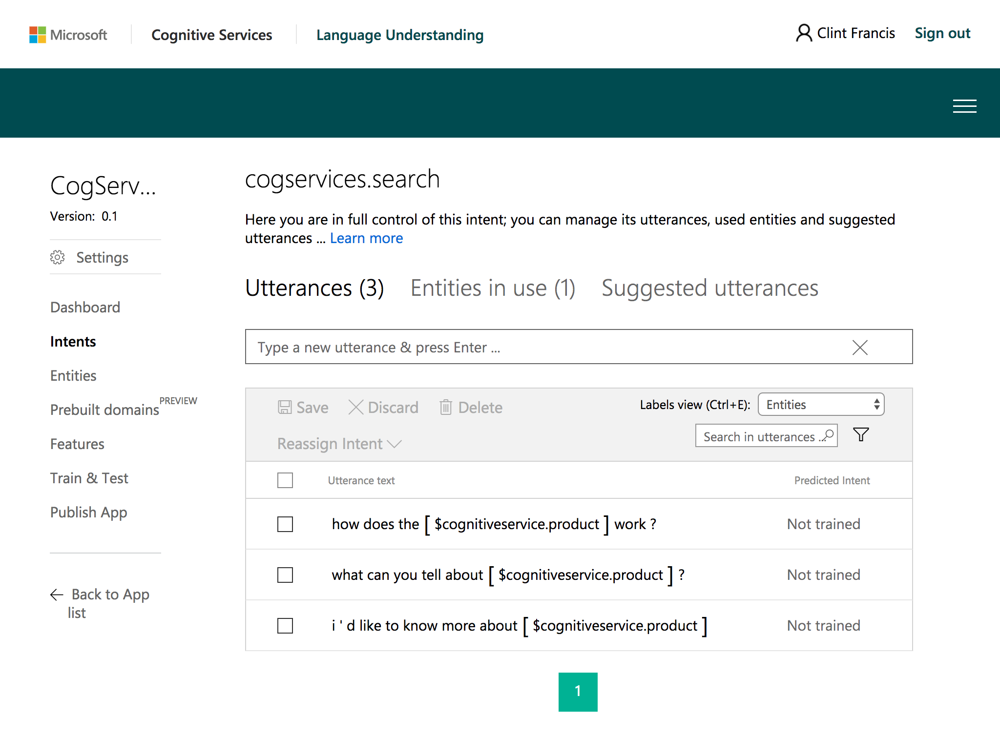

Once we've completed entering in our utterances for the `services.search` intent, we also need to repeat this same process for the `services.help` intent as well.

##### 5. Test and Train your LUIS instance
Whenever updates are made to the current LUIS model, we'll need to train the app before testing and publishing it. When we 'train' a model, LUIS generalises from the labeled examples, and develops code to recognise relevant intents and entities in the future.

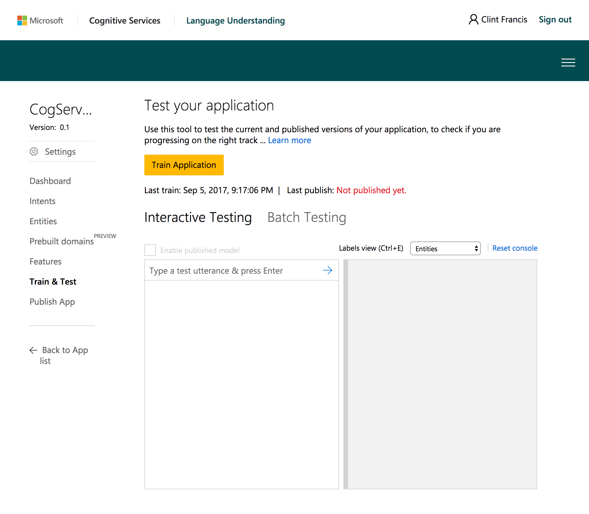

Once our model is trained we can try it out by typing test utterances in the text box to submit them to the app. The results of how the model has interpreted the utterance is displayed below, you're also able to click on previous utterances to review the results.

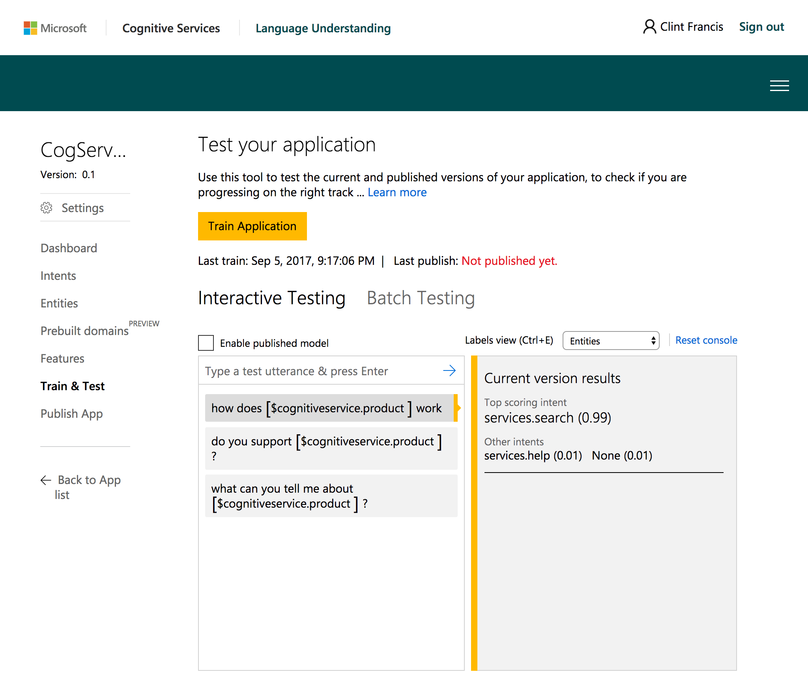

##### 6. Get the ID and key

The next things we're going to need to do is acquire an Endpoint key for LUIS from the Microsoft Azure portal. It is essential for publishing your app and accessing our HTTP endpoint. This key reflects our quota of endpoint hits based on the usage plan you specified while creating the key. For the purpose of our demo we can use the free pricing tier _F0 (5 calls per second, 10k calls per month)_.

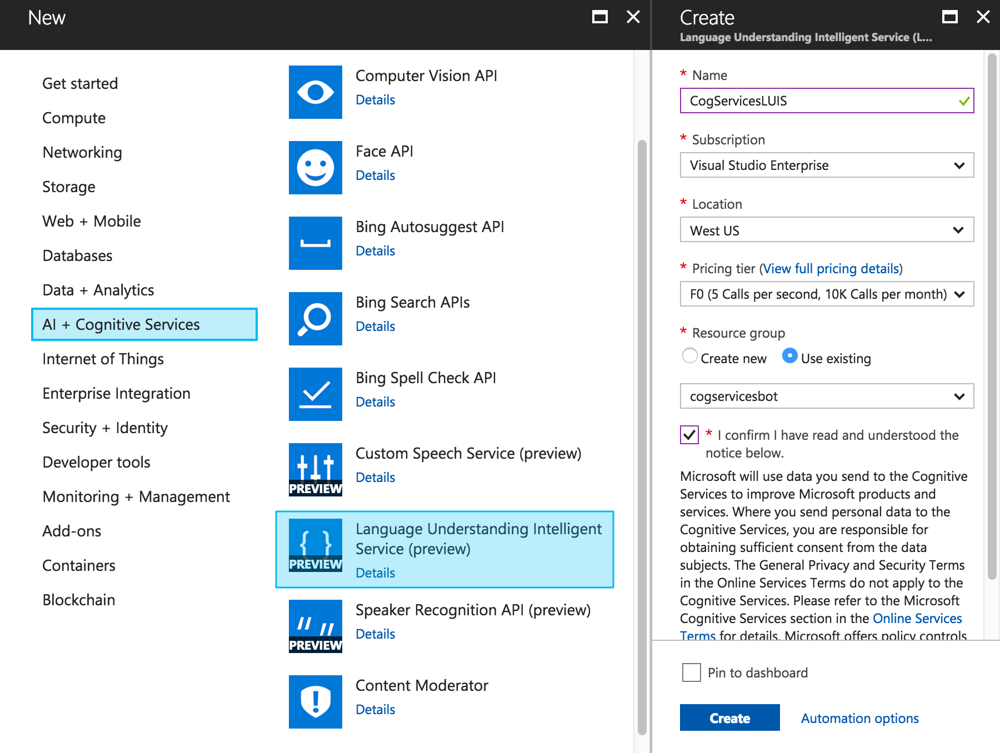

Once the LUIS keys have been set up, copy the first key to your clipboard and return to your LUIS app.

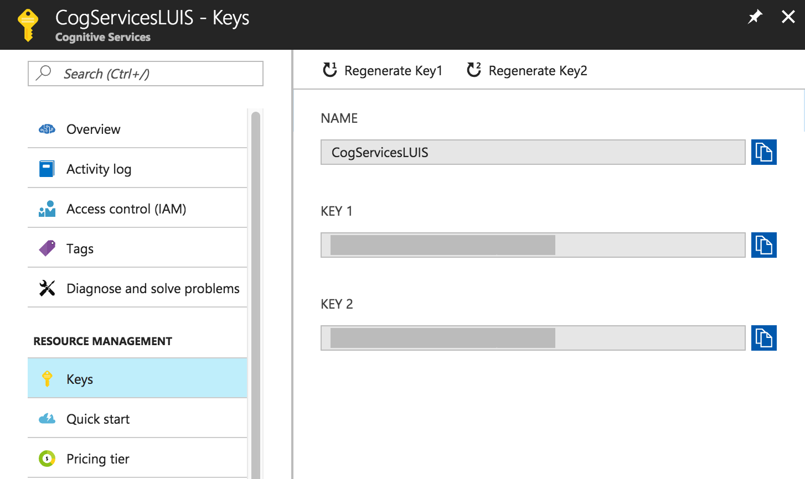

##### 7. Setup Key in LUIS

Add a new key in your LUIS app, paste in your copied key from Azure and give it an appropriate name.

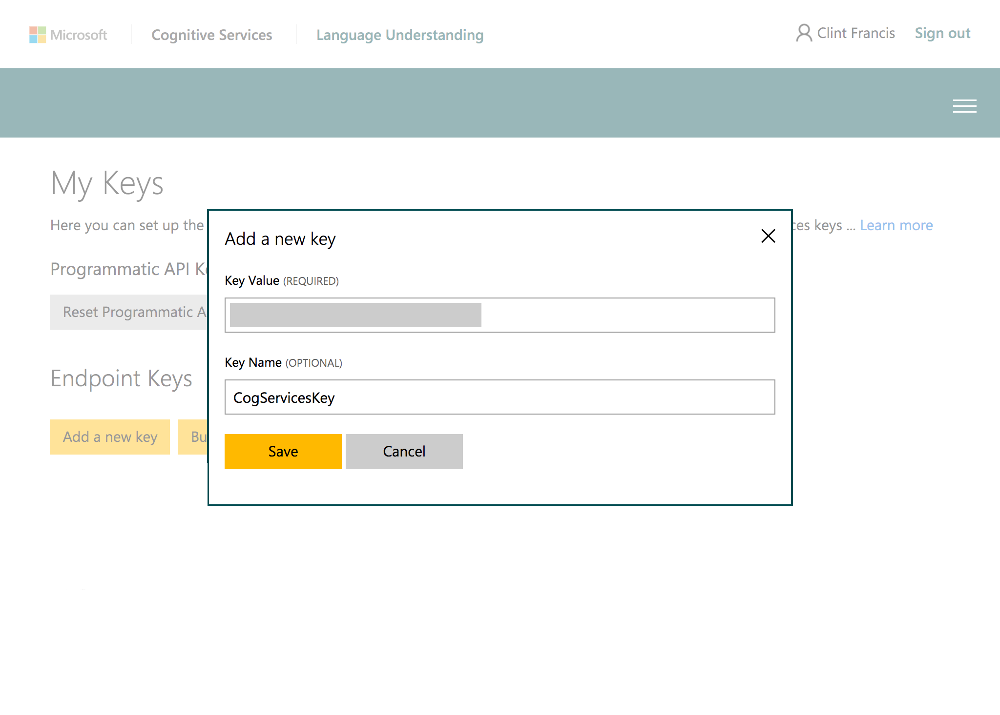

##### 8. Publish your LUIS app
Once the key is all set up we can publish our LUIS app. Head to the _Publish App_ tab and select your newly created Endpoint Key, then go ahead and hit Publish!

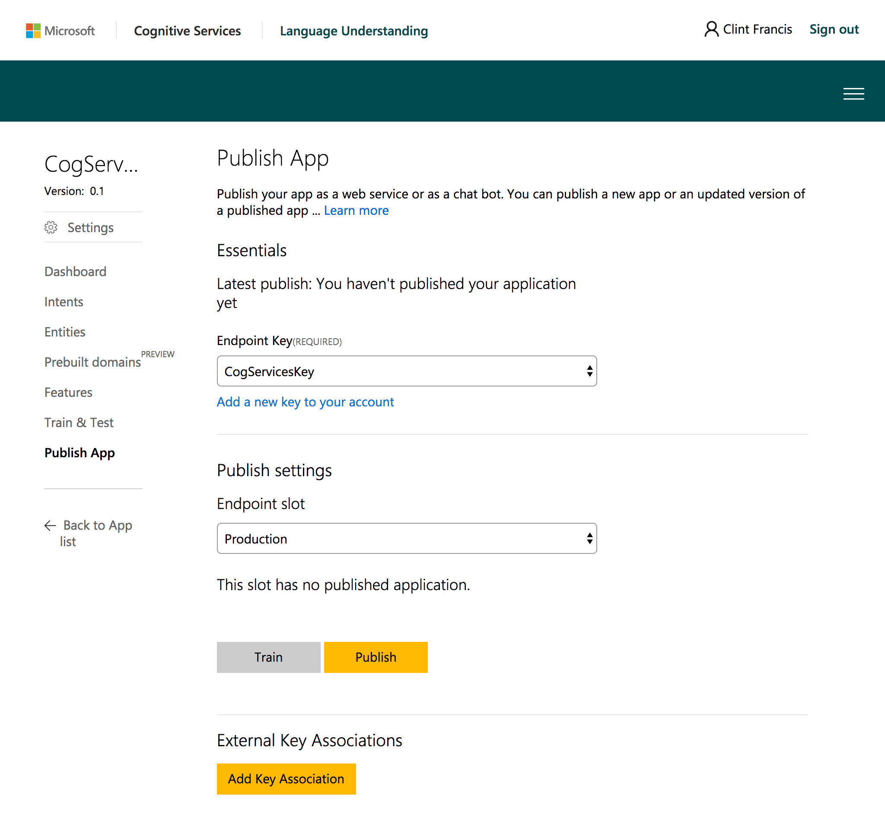

***

# The Bot

## Planning
### Discussion tree
[IMAGE]

## Building the Bot

We'll need to create a new Bot solution in Visual Studio for Windows. 

These instructions for C# only.

### Default Dialog
Have a way of handling our Luis intents

### Search and Explore Dialog

TODO

### Granular Dialogs
TODO

### Adaptive Cards

## Testing
### Testing the Bot
### Iterate

##### 1. Create a new Bot Service

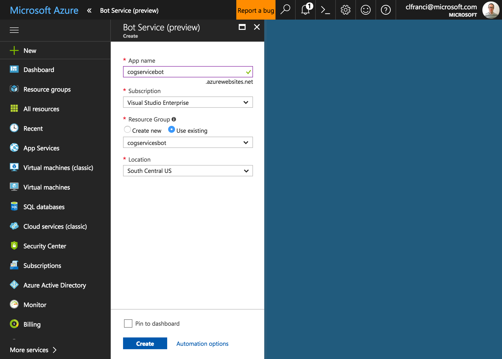

***

# Connectivity 

## Direct Line
Setup Direct line connectivity

### Mobile Connectivity & Templates

Do we need to download the Bot framework addin and from where?

### Other Channels

***

# Summary
TODO